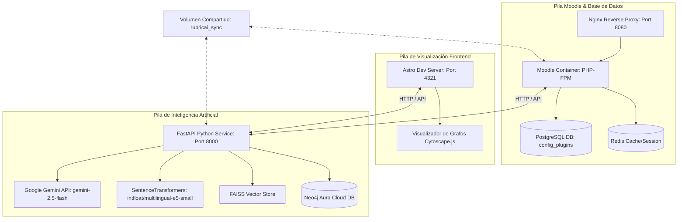
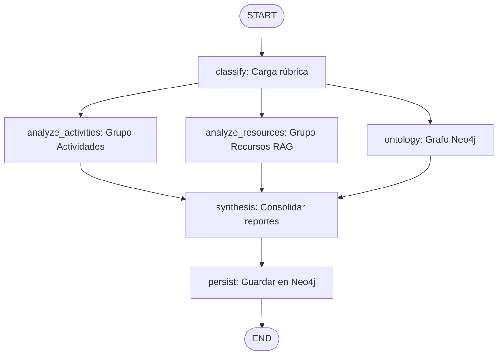
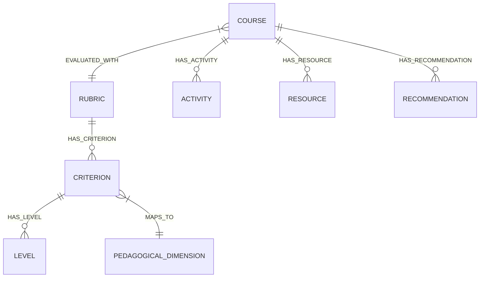

# RubricAI — Plataforma de Auditoría Pedagógica y de Formato Basada en Multi-Agentes, RAG y Grafos

**RubricAI** (anteriormente AreteIA) es una plataforma de análisis y auditoría educativa de última generación. Se integra nativamente en **Moodle** como un plugin local (`local/rubricai`) y se conecta a un microservicio de Inteligencia Artificial en Python (`rubricai_ai`), un frontend interactivo en **Astro** y una base de datos de grafos **Neo4j** (Aura Cloud).

El propósito de RubricAI es asistir a equipos de gestión y docentes evaluando de forma holística y técnica el diseño, completitud y la **alineación constructiva** de las actividades de un curso (cuestionarios, tareas, foros) y sus recursos contra una rúbrica institucional de calidad pedagógica sin alterar ni modificar el contenido real en Moodle.

---

## 1. Arquitectura General del Sistema

El sistema opera completamente contenedorizado mediante **Docker Compose**, dividiendo la infraestructura en tres áreas principales interconectadas de manera segura:



### Componentes Clave:
1. **Cliente RAG en PHP (`rag_client.php`)**: Moodle extrae metadatos y archivos y los envía mediante REST al contenedor `python_rag`.
2. **Servicio Python RAG (FastAPI)**: Expone endpoints para la ingesta (`/ingest`), búsqueda vectorial (`/search`), evaluación multiagente (`/evaluate`) y consulta de ontología (`/ontology`).
3. **Persistencia en Postgres**: Las auditorías completadas se almacenan permanentemente en la tabla `mdl_config_plugins` de Moodle, asegurando que las evaluaciones persistan más allá de la sesión.
4. **Neo4j Aura Cloud**: Almacena las rúbricas y las relaciones semánticas entre los cursos, actividades, calificaciones e ítems sugeridos.
5. **Astro Dashboard**: Panel web en modo oscuro premium con soporte Glassmorphism que consume la API de FastAPI para listar rúbricas y graficar la ontología pedagógica.

---

## 2. El Rol de RAG y Búsqueda Semántica

### ¿Para qué se usa RAG (Retrieval-Augmented Generation)?
Un modelo de lenguaje tradicional (LLM) no tiene acceso al contenido real de las asignaturas. Sin RAG, al auditar un curso, la IA sufriría de alucinaciones o tendría que asumir de qué tratan las lecturas. RAG soluciona esto en tres pasos:
1. **Recuperación**: Extrae el texto real de los archivos de soporte del docente (`.pdf`, `.docx`, `.pptx`) y de las descripciones, instrucciones y consignas de las actividades pedagógicas.
2. **Aumentación**: Selecciona los fragmentos semánticamente más relevantes para las preguntas, cuestionarios y foros definidos en Moodle.
3. **Generación**: Inyecta este contexto en el prompt de Gemini 2.5 Flash, forzando al modelo a fundamentar su auditoría estrictamente en el contenido real provisto al alumno.

### Indexación de Actividades Pedagógicas
Además de los archivos físicos cargados, el plugin de Moodle ([data_provider.php](file:///run/media/dracero/08c67654-6ed7-4725-b74e-50f29ea60cb2/pythonAI-Others/AreteIA/local/rubricai/classes/data_provider.php)) extrae y genera de forma dinámica archivos de texto virtuales (`.txt`) para actividades interactivas como:
* **Tareas (`assign`)**: Nombre de la tarea, instrucciones de entrega y consignas redactadas para el estudiante.
* **Foros (`forum`)**: Introducción y consigna de participación.
* **Cuestionarios (`quiz`)**: Nombre, descripción general y las preguntas asociadas.
* **Páginas y Libros (`page`/`book`)**: Contenidos informativos expuestos al estudiante.

Estos archivos virtuales se organizan bajo la estructura del directorio sincronizado y se indexan en el pipeline de RAG para contrastar de manera precisa qué se les solicita hacer a los alumnos frente a los contenidos de soporte teórico del curso.

### Pipeline Técnico RAG y FAISS:
* **Ingesta**: Divide los archivos físicos y virtuales (`.txt`) del curso en fragmentos de **1000 caracteres** (solapamiento de **250**) usando `RecursiveCharacterTextSplitter`.
* **Embedding**: Convierte los fragmentos en vectores de 384 dimensiones mediante el modelo de código abierto **`intfloat/multilingual-e5-small`**.
* **Indexación (FAISS)**: Guarda el índice vectorial localmente (`index.faiss`) y sus metadatos (`metadata.pkl`) bajo la carpeta del curso correspondiente.
* **Prefijos del Modelo E5**: Para optimizar la similitud, los fragmentos indexados se prefijan con `passage: `, mientras que las consultas de búsqueda se vectorizan con `query: `.
* **Mapeo de Similitud Pedagógica**: Los scores de similitud coseno de E5 (concentrados entre `0.80` y `0.95`) se normalizan linealmente a escala de `0%` a `100%`:
  - Cos$\ge 0.90$ $\rightarrow$ Escala de $85\%$ a $100\%$
  - Cos entre $0.84$ y $0.90$ $\rightarrow$ Escala de $50\%$ a $85\%$
  - Cos entre $0.80$ y $0.84$ $\rightarrow$ Escala de $5\%$ a $50\%$
  - Cos $< 0.80$ $\rightarrow$ Descartado (umbral mínimo).

> [!IMPORTANT]
> **Interdependencia de FAISS, HuggingFace y Neo4j**:
> El motor de búsqueda local **FAISS** no puede operar de forma aislada. Depende estrictamente de la generación previa de embeddings vectoriales mediante el modelo de **HuggingFace** (`intfloat/multilingual-e5-small`) y la base de datos de grafos de **Neo4j** (Aura Cloud) para registrar las relaciones semánticas. Si alguno de estos componentes no está disponible o configurado, la indexación y la auditoría pedagógica fallarán.

---

## 3. Orquestación Multi-Agente en Paralelo (`LangGraph`)

Al enviar una solicitud a `/evaluate`, el sistema inicia un flujo de trabajo asíncrono y en paralelo coordinado por **LangGraph** (`rubricai_ai/graph.py`). La arquitectura implementa una topología de bifurcación y unificación (**Fan-out / Fan-in**) que divide la auditoría en tareas paralelas e independientes:



### Flujo de Auditoría y Agentes Involucrados:
1. **Fase Inicial (`classify`):** Recupera la rúbrica institucional desde Neo4j.
2. **Fase Paralela (Fan-out):** Ejecuta tres ramas de forma simultánea reduciendo notablemente los tiempos de respuesta:
   * **`analyze_activities`:** Evalúa secuencialmente las actividades de interacción pedagógica mediante el `HTMLContentAgent` (claridad y formato de consignas), `QuizAgent` (auditoría de cuestionarios y taxonomía de Bloom), `AssignmentAgent` (tareas y fechas de corte) y `ForumAgent` (debates e interacciones).
   * **`analyze_resources`:** Audita los materiales y soportes teóricos usando el `DocumentAgent` (RAG con embeddings y FAISS local), `YouTubeAgent` (descarga y análisis de transcripciones) y `URLResourceAgent` (links externos).
   * **`ontology`:** Sincroniza la estructura pedagógica completa en Neo4j en paralelo.
3. **Fase de Consolidación (Fan-in - `synthesis`):** Espera el término de todas las ramas e invoca al `SynthesisAgent` para calcular el puntaje general (`overall_score`) y estructurar el plan de acción en JSON.
4. **Fase de Persistencia (`persist`):** Guarda los resultados finales en la base de datos de grafos de Neo4j.

> [!TIP]
> Para obtener una explicación técnica detallada de la arquitectura de grafos de estado, definición de nodos y monitoreo jerárquico con LangSmith, consulta el [README de rubricai_ai](file:///run/media/cetec/c182e059-3c92-4885-9b5a-0b2f0aeaadfe/AIProjects/rubricAI/rubricai_ai/README.md).

---

## 4. Esquema de Grafo en Neo4j

La base de datos de grafos modela tanto la rúbrica de calidad como la estructura e histórico de auditoría de los cursos de Moodle:



### Nodos y Relaciones Críticas:
* **`(:Rubric {id, title, description})`**: Representa la rúbrica de calidad.
* **`(:Criterion {id, name, description, weight})`**: Criterio de evaluación.
* **`(:Level {id, label, score, description})`**: Descriptor de logro para cada nivel del criterio.
* **`(:Course {id, name})`**: El aula virtual auditada.
* **`(:Activity {id, name, type, description, duedate})`**: Actividades nativas del curso Moodle.
* **`(:Resource {id, name, type, filename})`**: Archivos pedagógicos y materiales.
* **`(:Recommendation {id, element, type, issue, change})`**: Las recomendaciones accionables registradas para el curso.
* **`[:EVALUATED_WITH {score, timestamp}]`**: Relación que conecta el curso con la rúbrica e indica la nota obtenida.

> [!IMPORTANT]
> **Regla de Rúbrica Única**: Al subir una rúbrica nueva mediante la API (`POST /rubrics`), el sistema ejecuta un comando Cypher `DETACH DELETE` sobre todos los nodos `:Rubric`, `:Criterion` y `:Level` previos en Neo4j, asegurando que la base de datos mantenga únicamente la rúbrica institucional activa cargada en ese momento.

---

## 5. Persistencia de Auditoría en Moodle

Para optimizar el rendimiento y evitar depender del estado de la sesión web del navegador (que expira con el tiempo o al cerrar sesión), RubricAI utiliza la persistencia de base de datos nativa de Moodle:

* **Estructura Interna**: En [session_manager.php](file:///run/media/dracero/08c67654-6ed7-4725-b74e-50f29ea60cb2/pythonAI-Others/AreteIA/local/rubricai/classes/session_manager.php) se definieron funciones basadas en la API global `set_config()`, `get_config()` y `unset_config()`.
* **Guardado**: Tras finalizar la evaluación con el microservicio, `action_handler::handle_run_compare` guarda la nota, descripciones y el plan de acción bajo llaves dinámicas tipo `compare_score_{course_id}` asociadas al plugin `local_rubricai` en la tabla `mdl_config_plugins`.
* **Carga**: Al ingresar a la interfaz del paso 8 en Moodle, el controlador comprueba si existen configuraciones guardadas en la base de datos para el ID de curso activo. Si existen, muestra la interfaz de resultados inmediatamente sin realizar nuevas peticiones HTTP.
* **Recalculación**: Al hacer click en *Repetir Auditoría*, el sistema borra físicamente los registros asociados de la tabla `mdl_config_plugins` y restablece el formulario de selección.

---

## 6. Configuración de Variables de Entorno (`.env`)

Crea un archivo `.env` en la raíz del proyecto basándote en el siguiente esquema:

```env
# Nombre de Proyecto en Docker
COMPOSE_PROJECT_NAME=rubricai
COMPOSE_FILE=docker-compose.yml

# Configuración del Aula Virtual Moodle
MOODLE_VERSION=MOODLE_405_STABLE
MOODLE_URL=http://localhost:8080
MOODLE_DATA_ROOT=/var/www/moodledata

# Configuración de Base de Datos PostgreSQL
DB_TYPE=pgsql
DB_HOST=db
DB_NAME=moodle
DB_USER=dbuser
DB_PASS=password
DB_PORT=5432

# Cuenta de Administrador de Moodle
MOODLE_ADMIN_USER=admin
MOODLE_ADMIN_PASS=Password123!
MOODLE_ADMIN_EMAIL=email@example.com
MOODLE_FULLNAME=RubricAI Moodle
MOODLE_SHORTNAME=RubricAI

# Configuración del Microservicio de IA
RUBRICAI_SYNC_PATH=./data/sync
RUBRICAI_AI_URL=http://localhost:8000
HF_TOKEN=hf_xxxxxxxxxxxxxxxxxxxxxxxxxxxxx

# Configuración del Proveedor de LLM (Google Gemini Studio)
LLM_PROVIDER=google
GOOGLE_API_KEY=XXXXX
GOOGLE_MODEL=gemini-2.5-flash

# Base de Datos de Grafos Neo4j (Aura Cloud)
NEO4J_URI=neo4j+s://aa211074.databases.neo4j.io
NEO4J_USERNAME=aa211074
NEO4J_PASSWORD=XXXXXX
NEO4J_DATABASE=aa211074
AURA_INSTANCEID=aa211074
AURA_INSTANCENAME=Instance01-barto
```

---

## 7. Despliegue y Guía de Comandos de Administración (Docker)

A continuación se detallan todos los comandos necesarios para desplegar, apagar, monitorear y depurar la infraestructura de **RubricAI**:

### 7.1. Control del Ciclo de Vida de los Contenedores

* **Levantar la infraestructura completa (Moodle, RAG, Frontend, etc.)**:
  Construye las imágenes del backend RAG y del frontend Astro, y levanta todos los contenedores en segundo plano:
  ```bash
  docker compose up -d --build
  ```

* **Apagar la infraestructura (Detener contenedores)**:
  Detiene todos los contenedores activos de la pila sin borrar los datos persistidos en los volúmenes:
  ```bash
  docker compose down
  ```

* **Apagar y eliminar volúmenes (Reinicio completo/Limpieza total)**:
  > [!WARNING]
  > Esto borrará la base de datos de PostgreSQL y la caché de HuggingFace local.
  ```bash
  docker compose down -v
  ```

* **Verificar el estado de todos los contenedores**:
  Muestra una tabla con el ID, estado de salud y mapeo de puertos de cada contenedor de la pila:
  ```bash
  docker compose ps
  ```

### 7.2. Monitoreo de Logs y Diagnóstico

Para depurar y entender el comportamiento del sistema (como los tiempos de respuesta de los agentes de IA, errores de base de datos o llamadas a la API de Gemini), puedes monitorear los logs de los contenedores Docker de dos maneras:

#### A) Utilizando Docker Compose (Recomendado, ejecutado desde la raíz del proyecto)

Puedes usar los nombres de los **servicios** definidos en `docker-compose.yml`:

| Servicio | Comando para ver Logs en Tiempo Real | Propósito |
| :--- | :--- | :--- |
| **Todos** | `docker compose logs -f` | Monitorear la actividad completa de todo el ecosistema. |
| **`python_rag`** | `docker compose logs -f python_rag` | Logs de FastAPI, ejecución de agentes LangGraph, RAG y FAISS. |
| **`moodle`** | `docker compose logs -f moodle` | Logs de Moodle (PHP-FPM) y callbacks de ejecución del plugin local. |
| **`frontend`** | `docker compose logs -f frontend` | Logs de la interfaz Astro y el servidor Vite. |
| **`db`** | `docker compose logs -f db` | Logs del servidor PostgreSQL. |
| **`redis`** | `docker compose logs -f redis` | Logs de almacenamiento en caché y sesiones Redis. |

#### B) Utilizando comandos nativos de Docker (Desde cualquier directorio)

Si prefieres usar los comandos estándar de Docker, debes referirte a los nombres de los **contenedores** (`container_name`):

* **Logs del Motor de IA (FastAPI)**:
  ```bash
  docker logs -f python_rag
  ```
* **Logs del Servidor PHP/Moodle**:
  ```bash
  docker logs -f moodle_app
  ```
* **Logs del Dashboard de Astro**:
  ```bash
  docker logs -f astro_frontend
  ```

#### C) Comandos Útiles de Diagnóstico

* **Ver las últimas $N$ líneas de un servicio**:
  Para evitar cargar todo el historial, puedes usar el parámetro `--tail`:
  ```bash
  # Ver las últimas 100 líneas del servicio de IA
  docker compose logs --tail=100 python_rag
  
  # Ver las últimas 50 líneas del contenedor de Moodle
  docker logs --tail 50 moodle_app
  ```

* **Filtrar logs para buscar errores específicos**:
  Puedes combinar la salida con `grep` para buscar excepciones o códigos de estado:
  ```bash
  # Buscar errores HTTP 4xx o 5xx en el motor de IA
  docker compose logs python_rag | grep -E "HTTP/[0-9.]+ [45][0-9][0-9]"

  # Buscar errores de tasa de límite (Rate limit / Error 429) o de API Key (Error 403)
  docker compose logs python_rag | grep -iE "(rate_limit|quota|limit|429|403)"
  ```

* **Limpiar el archivo de logs de un contenedor**:
  Si los logs crecen demasiado y deseas vaciarlos sin reiniciar el contenedor, puedes truncar el archivo de logs directamente en el host (requiere privilegios `sudo`):
  ```bash
  sudo truncate -s 0 $(docker inspect --format='{{.LogPath}}' python_rag)
  ```

### 7.3. Comandos de Administración de Moodle

* **Limpiar la caché de Moodle**:
  Esencial tras modificar archivos del plugin, dependencias o variables de entorno del contenedor:
  ```bash
  docker compose exec moodle php admin/cli/purge_caches.php
  ```

* **Ejecutar el cron de Moodle manualmente**:
  Útil para procesar colas de tareas pendientes, correos u otras tareas diferidas en Moodle:
  ```bash
  docker compose exec moodle php admin/cli/cron.php
  ```

### 7.4. Scripts Auxiliares del Proyecto

* **Restaurar cursos de prueba en Moodle**:
  Inyecta copias de seguridad de asignaturas de prueba de forma masiva en el Moodle contenedorizado:
  ```bash
  bash scripts/import_courses.sh
  ```

* **Empaquetar el plugin para distribución externa**:
  Genera el archivo comprimido `rubricai_plugin.zip` en la raíz del proyecto listo para ser instalado en cualquier servidor Moodle:
  ```bash
  bash package_plugin.sh
  ```

---

## 8. Detalle y Estructura de Contenedores (Dockerfiles)

La plataforma RubricAI se divide en tres `Dockerfiles` específicos para cada capa del sistema:

### 8.1. Moodle App Container (Servidor Principal)
* **Archivo**: [`Dockerfile`](file:///run/media/dracero/08c67654-6ed7-4725-b74e-50f29ea60cb21/pythonAI-Others/AreteIA/Dockerfile)
* **Base**: `php:8.1-fpm-bookworm`
* **Descripción**: Instala todas las dependencias necesarias de PHP para Moodle (GD, Intl, OPcache, PostgreSQL, mysqli, zip, Redis, Memcached, Sodium). Genera las configuraciones regionales UTF-8 y clona la versión de Moodle configurada en `.env` (`MOODLE_VERSION=MOODLE_405_STABLE`).

### 8.2. Microservicio de Inteligencia Artificial (FastAPI)
* **Archivo**: [`rubricai_ai/Dockerfile`](file:///run/media/dracero/08c67654-6ed7-4725-b74e-50f29ea60cb21/pythonAI-Others/AreteIA/rubricai_ai/Dockerfile)
* **Base**: `python:3.11.9-slim`
* **Descripción**: Configura el backend de agentes y RAG. Instala dependencias desde `requirements.txt` usando cache mounts de BuildKit para agilizar compilaciones, y corre el servidor Uvicorn en el puerto `8000`.

### 8.3. Frontend de Visualización (Astro)
* **Archivo**: [`frontend/Dockerfile`](file:///run/media/dracero/08c67654-6ed7-4725-b74e-50f29ea60cb21/pythonAI-Others/AreteIA/frontend/Dockerfile)
* **Base**: `node:22-alpine`
* **Descripción**: Contenedoriza la interfaz Astro del panel de control. Instala dependencias con `npm install` y corre el servidor de desarrollo (`npm run dev`) mapeando el puerto `4321` y exponiéndolo al host mediante la directiva `--host`.

---

## 9. Comandos para Levantar Todo el Ecosistema

Dado que el archivo `.env` declara de forma unificada el archivo de Docker Compose:
`COMPOSE_FILE=docker-compose.yml`

Puedes administrar y levantar **todos** los contenedores con un único comando:

### Levantar y compilar todos los servicios:
```bash
docker compose up -d --build
```

### Detener todos los servicios:
```bash
docker compose down
```


